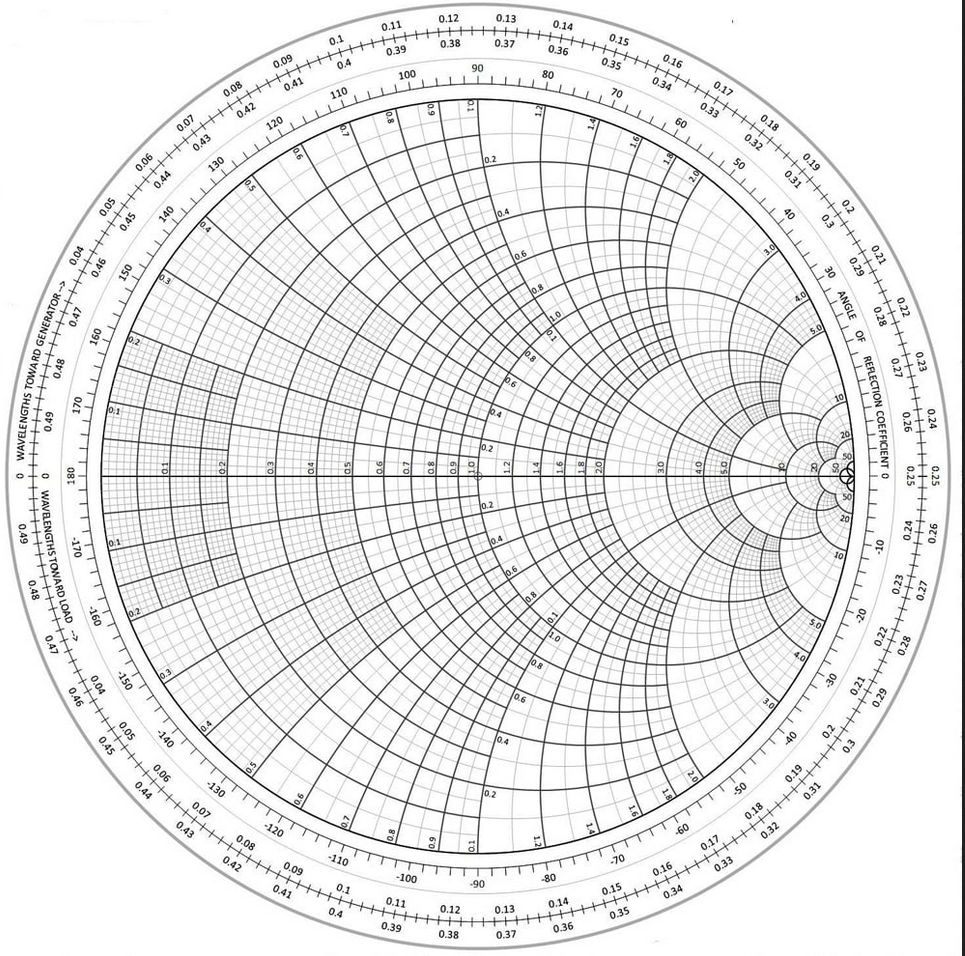

There is a surprising similarity between the equations governing transmission line theory and special relativity. In particular, in 1+1D special relativity we have Lorentz boosts corresponding to rotation in hyperbolic space. Similarly, the change of position along the transmission line changes the voltage and current with a similar rotation.
In special relativity, the Lorentz boost with velocity $v$ reads
$$
t' = \gamma(t - x/v)\\
x' = \gamma(x - vt)
$$
this respects the invariance of the elementary distance in hyperbolic space, namely
$$
ds^2= dx^2 - c^2 dt^2
$$
Furthermore, we can define a rapidity parameter $\phi$ such that
$$
\th(\phi) = v/c
$$
$\th$ being the hyperbolic tangent function, so that the Lorentz boost can be rewritten as
$$
t' = t \ch(\phi) - (x/c) \sh(\phi) \\
x' = ct \sh(\phi) - x \ch(\phi)
$$
Therefore, the resulting transformation assumes the form of a rotation in hyperbolic space of an angle $\phi$.

In electromagnetic engineering, it is well known that we can describe the voltages $V$ and currents $I$ in a position in the transmission line by using the local impedance $Z$, related to the characteristic impedance $Z_0$.
$$
Z = Z_0 \frac{\Gamma-1}{\Gamma+1} 
$$
By changing the position along the line of a lenght $z$, we can calculate the transformation of the voltage and current by involving the forward and the backward propagating waves (with guided wavenumber $\beta$)
$$
V' = V_+ e^{-i\beta z} + V_{-}e^{i\beta z}
$$
and
$$
I' = I_+ e^{-i\beta z} + I_{-}e^{i\beta z}
$$
Remember that $V_{-} =\Gamma V_{+}$ and $I_{-} = -\Gamma I_{+}$ (show better).
The local impedance transforms like
$$
Z' = Z_0 \frac{\Gamma e^{-i2\beta z}-1}{\Gamma e^{-i2\beta z} + 1}
$$
After a little manipulation, this corresponds to 
$$
Z' = Z_0 \frac{Z_0 + iZ\th(i2\beta)}{Z + iZ_0 \th(i2\beta)}
$$

The usage of the Smith chart is well established in electromagnetic engineering. We prove now that it can be utilized also for making calculations in 1+1D problems in special relativistic mechanics.

