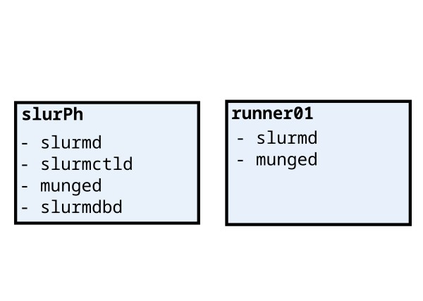

## Desired topology and active services


## SLURM super quick start guide 
The guide is available [here](https://slurm.schedmd.com/quickstart_admin.html).

On Centos8Stream, we first install MUNGE, then install SLURM by the bzip package

```
wget https://download.schedmd.com/slurm/slurm-23.11.3.tar.bz2
```
We then unzip, configure, and build SLURM

We then need to create, by the SLURM user "slurm", the directories of 
- [x] log files
- [ ] PID files
- [x] State save 

and make them writable. We take inspiration from an existing ```slurm.conf``` file.
So the directories will be 
| Function          | Directory            |
|-------------------|----------------------|
| PID files         | ---                  |
| SlurmdSpoolDir    | /var/spool/slurmd    |
| StateSaveLocation | /var/spool/slurmctld |


Beware, ```slurm``` is not in the sudoers group (and it must not be!).
If the directories are already there, we must ```chown``` them, and ```chmod``` them to writable by ```slurm```.
This can be done only by a sudoer. 

In order to use the SLURM API, we must link to the libraries
```
ldconfig -n <library-location>
```
in our case ```<library-location>``` is in the downloaded (and built) package.

## A handy alternative: RPM
We can use  ```rpmbuild``` to directly install and configure the directories and link the libraries.
We do it in the ```slurm``` user.

This method show a missing dependency
```
error: Failed build dependencies:
	mariadb-devel >= 5.0.0 is needed by slurm-23.11.3-1.el8.x86_64
```
that we can easily solve by 
```
sudo yum install mariadb-devel  
```

A warning in the ```rpmbuild``` suggest to run ```libtool --finish /lib64/security```. We do it, installing ```libtool``` first
> We still have the problem that the commands are not available.
> The SLURM services are not available.

The RPM files are loacated into 
```
~/rpmbuild/RPMS
```
so we need to run 
```
rpm -i *.rpm
```
inside the rpms folder.

## slurm.conf 
We use the generator tool to make the ```slurm.conf``` file 

We can now enable the daemons
```
systemctl enable slurmctld
systemctl enable slurmdbd
systemctl enable slurmd 
```
and activate them
```
systemctl start slurmctld
systemctl start slurmdbd
systemctl start slurmd 
```
The order is important!
> We have a problem in starting the ```slurmdbd``` service:
> ```Condition: start condition failed at Sun 2024-02-11 17:10:08 CET; 8min ago```
> ```          └─ ConditionPathExists=/etc/slurm/slurmdbd.conf was not met```
This is due to 
> ```slurmdbd: error: s_p_parse_file: unable to read "/etc/slurm/slurmdbd.conf": Permission denied```

Also, we got error
```
Feb 11 17:26:11 slurph.novalocal slurmdbd[7414]: slurmdbd: error: mysql_real_connect failed: 2002 Can't connect to local MySQL server through socket '/var/lib/mys>
```
## Useful resources for SLURM management
 - [SLURM cheatsheet](https://www.carc.usc.edu/user-information/user-guides/hpc-basics/slurm-cheatsheet)
 - [SLURM config file generator](https://slurm.schedmd.com/configurator.html)